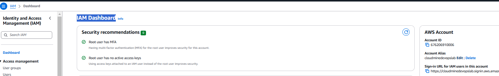
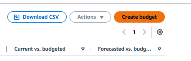
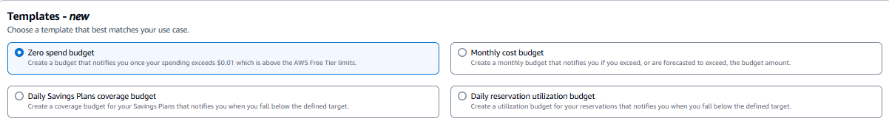
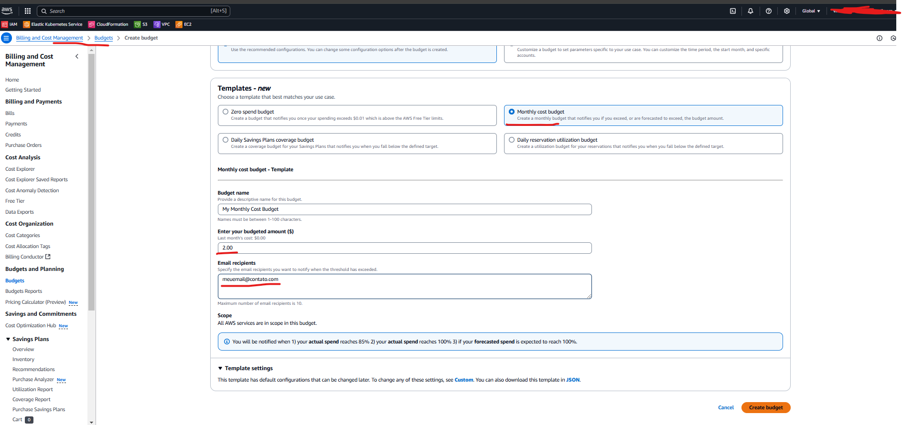
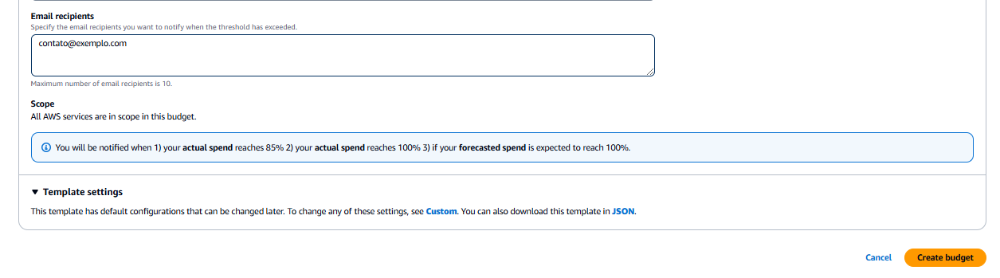
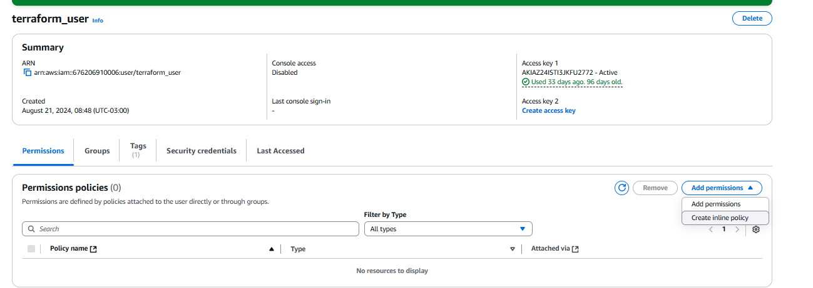

## Atenticação e Controle de acesso(Básico)

O gerenciamento das permissões dos usuários é feita através do IAM(Identity Access Management)

Seguindo as boas práticas, o ideal é que as permissões sejam delegadas a um grupo, e os usuários sejam inclusos no grupo cujo o qual possui a permissão. Dessa forma, oque há mais de importante nessa parte, é entender oque são Roles, Policies.


### Criar alias account

1 - Acesse o IAM.
2 - Em IAM Dashboard, na direita, teremos um card com o AWS ACCOUNT, onde será possivel definir o Alias.




Para saber mais acesse [Criar alias para a conta](https://docs.aws.amazon.com/pt_br/accounts/latest/reference/manage-acct-alias.html)


## Criar alerta para orçamento

1 - Acesse Billing and Payments.<br/>
2 - Agora vá em Budgets.<br/>
3 - Clique em Create budget.<br/>



<br/>
4 - Selecione entre os tipos de template "Mensal, diário" e etc. No meu caso foi o mensal. <br/>



5 - Defina o Budget name.<br/>
6 - Defina o Enter your budgeted amount ($).<br/>





7 - Por último  o e-mail que deverá receber as notificações.(Podendo ser 1 ou mais e-mails)




# Switch the role user

A alteração de role é simples. Mas o requisito minímo é que o usuário tenha o acesso para alterar sua própria role. Para isso, precisamos entender que inicialmente, o usuário na AWS não pode trocar para uma função que não possui. Antes disso precisa ele precisa da permissão de ação assumida pelo STS.


Criei a role abaixo, inclui no usupario, por meio de inline policy. Acessando Users -> Nome-Usuario -> Add Permissions -> Create inline policy




```json
{
	"Version": "2012-10-17",
	"Statement": 		{
			"Sid": "Statement1",
			"Effect": "Allow",
			"Action": "sts:AssumeRole",
			"Resource": "arn:aws:iam::676206910006:role/ec2-role"
		}
}

```


## Mais sobre Policies e Roles

### Policies
Oque são as policies ? São regras que definem oque pode ou não pode ser feito. Elas descrevem as permissões.

Exemplo prático:

- Ação: "O que alguém pode fazer?" (ex.: s3:ListBucket, ec2:StartInstances).
- Recurso: "Onde isso pode ser feito?" (ex.: no bucket my-bucket ou em instâncias EC2 específicas).
- Condições: "Quando ou como essas ações são válidas?" (ex.: só se vier de um IP específico).
👉 Policies não fazem nada sozinhas. Elas precisam estar associadas a algo (usuários, grupos ou roles) para serem úteis.


### Roles
O que são? As roles são identidades temporárias usadas por serviços, aplicações ou contas para executar ações com permissões específicas.
- Imagine que uma role é como um crachá temporário: quem usa a role "veste" um conjunto de permissões (policies associadas) por um tempo limitado.
- Roles não têm credenciais fixas. Elas dependem de algo (como STS no AWS) para fornecer credenciais temporárias.


### Como Roles e Policies Funcionam Juntas?

A relação é a seguinte:

- A role tem permissões definidas pelas policies associadas.

- Uma role é inútil sem policies, porque precisa de regras para saber o que pode fazer.
- Uma policy sozinha não faz nada até ser associada a um recurso (como uma role).

- É a role que "usa" as permissões definidas na policy.
- Quem pode usar a role é definido por uma Trust Policy.

 - Enquanto as policies definem o que a role pode fazer, a Trust Policy define quem pode assumir a role.


 #### Exmeplo de Policy

 ```json
 {
  "Version": "2012-10-17",
  "Statement": [
    {
      "Effect": "Allow",
      "Action": "s3:PutObject",
      "Resource": "arn:aws:s3:::meu-bucket/*"
    }
  ]
}
 ```

 - Ação (Action): Permite salvar objetos (s3:PutObject).
 - Recurso (Resource): No bucket meu-bucket.
 - Efeito (Effect): Allow (permitir).


#### Exmeplo de role associada a uma policy

```json
{
  "Version": "2012-10-17",
  "Statement": [
    {
      "Effect": "Allow",
      "Principal": {
        "Service": "ec2.amazonaws.com"
      },
      "Action": "sts:AssumeRole"
    }
  ]
}


```
Essa Trust Policy diz: Instâncias EC2 podem assumir essa role.

3. Como Isso Funciona?
 - A aplicação na EC2 assume a role.
 - A role "carrega" as permissões da policy associada.
 - A aplicação agora pode acessar o bucket S3 para salvar arquivos, porque:
 - A policy define que s3:PutObject é permitido.
 - A role dá as credenciais temporárias para executar essas ações.